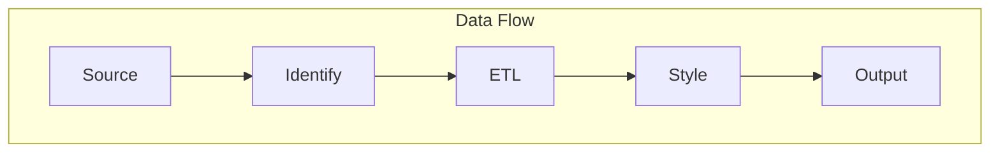

COUTURE
=======

OVERVIEW
--------

## ARCHITECTURE

Modern software architectures mean logs exist in many places and modalities.
This makes it difficult to aggregate and analyze logs in a single place.
The slow cognitive toll of context switching between different log sources
can be a significant productivity drain. It is also far harder to correlate
events across different log sources.

Couture fans in the log data from multiple sources. It then identifies their
format – if known – and maps them to a generic event. The generic event is then
laid out in a structured format. Finally, the structured event is themed for
output. Events are then filtered on a per-output basis before being sent to
their external outputs.

An event is any discrete occurrence that can be logged. The smallest unit supported
is a line of text. An event may span multiple lines. It may be structured or unstructured.
Each External event has a lifecycle resulting in it being rejected or passed on to one or
more outputs.

See § [Flow](./100__flow.md) for more information.

## KNOWN LIMITATIONS

#### Non-POSIX Systems

Support for non-POSIX systems is limited. Terminal window resizing triggers
SIGWINCH, which is not supported on systems such as Windows. This means
dynamic column resizing is not supported. The workaround is to pre-size the
window.

**See:** _signal(3)_

The build flags `windows` and `!windows` are used to exclude the `SIGWINCH`
on Windows systems. The file `table_windows.go` current contains an empty
method. The is there [SIGWINCH Equivalent on Windows](https://stackoverflow.com/a/10857339/2154219)
StackOverflow post is a starting point to implementing the Windows feature.

## SUPPORT

Contact the author at <panda@gaggle.net>.
