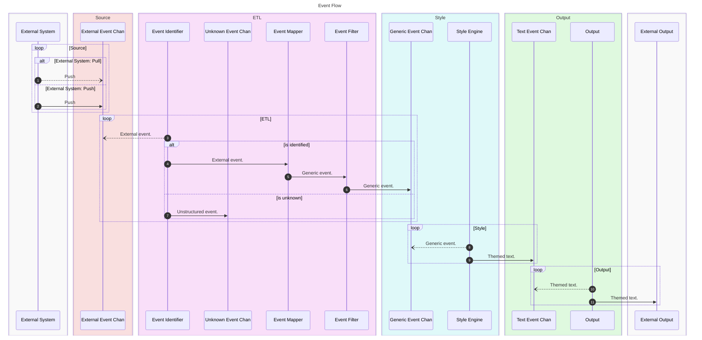

COUTURE
=======

FLOW
----

## EVENT LIFECYCLE

Events flow from external sources to external outputs. Each event is identified, mapped, filtered,
styled, and outputted.

```mermaid
sequenceDiagram
	autonumber
	title Event Flow

	box rgba(255, 255, 255, .1)
		participant External System
	end

	box rgba(255, 0, 0, .1) Source
		participant External Event Chan
	end

	box rgba(255, 0, 255, .1) ETL
		participant Event Identifier
		participant Unknown Event Chan
		participant Event Mapper
		participant Event Filter
	end

	box rgba(0, 255, 255, .1) Style
		participant Generic Event Chan
		participant Style Engine
	end

	box rgba(0, 255, 0, .1) Output
		participant Text Event Chan
		participant Output
	end

	box rgba(255, 255, 255, .1)
		participant External Output
	end

	loop Source
		alt External System: Pull
			External System --) External Event Chan: Push
		else External System: Push
			External System ->> External Event Chan: Push
		end
	end

	loop ETL
		Event Identifier --) External Event Chan: External event.
		alt is identified
			Event Identifier ->> Event Mapper: External event.
			Event Mapper ->> Event Filter: Generic event.
			Event Filter ->> Generic Event Chan: Generic event.
			destroy Unknown Event Chan
		else is unknown
			Event Identifier ->> Unknown Event Chan: Unstructured event.
		end
	end

	loop Style
		Style Engine --) Generic Event Chan: Generic event.
		Style Engine ->> Text Event Chan: Themed text.
	end

	loop Output
		Output --) Text Event Chan: Themed text.
		Output ->> External Output: Themed text.
	end
```
