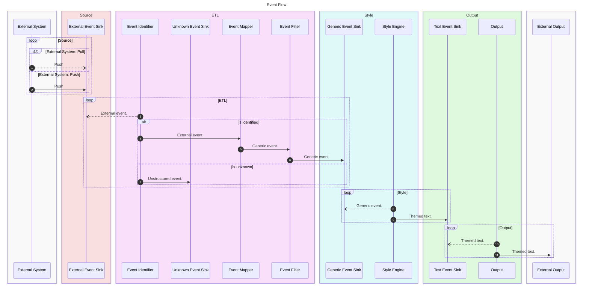

FLOW
====

OVERVIEW
--------

```mermaid
sequenceDiagram
	autonumber
	title Event Flow

	box rgba(255, 255, 255, .1)
		participant External System
	end

	box rgba(255, 0, 0, .1) Source
		participant External Event Sink
	end

	box rgba(255, 0, 255, .1) ETL
		participant Event Identifier
		participant Unknown Event Sink
		participant Event Mapper
		participant Event Filter
	end

	box rgba(0, 255, 255, .1) Style
		participant Generic Event Sink
		participant Style Engine
	end

	box rgba(0, 255, 0, .1) Output
		participant Text Event Sink
		participant Output
	end

	box rgba(255, 255, 255, .1)
		participant External Output
	end

	loop Source
		alt External System: Pull
			External System --) External Event Sink: Push
		else External System: Push
			External System ->> External Event Sink: Push
		end
	end

	loop ETL
		Event Identifier --) External Event Sink: External event.
		alt is identified
			Event Identifier ->> Event Mapper: External event.
			Event Mapper ->> Event Filter: Generic event.
			Event Filter ->> Generic Event Sink: Generic event.
			destroy Unknown Event Sink
		else is unknown
			Event Identifier ->> Unknown Event Sink: Unstructured event.
		end
	end

	loop Style
		Style Engine --) Generic Event Sink: Generic event.
		Style Engine ->> Text Event Sink: Themed text.
	end

	loop Output
		Output --) Text Event Sink: Themed text.
		Output ->> External Output: Themed text.
	end
```
